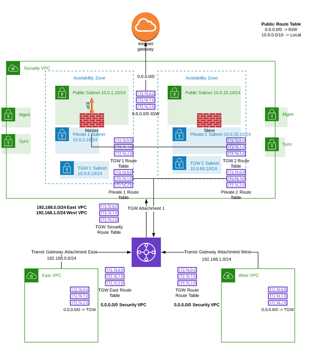

# FortiOS FGCP AP HA (Dual AZ) with TGW Attachments in AWS


## Table of Contents
  - [Overview](./README.md#overview)
  - [Solution Components](./README.md#solution-components)
  - [Terraform Templates](./README.md#terraform-templates)
  - [Deployment](./README.md#deployment)
  - [FAQ \Troubleshoot](./README.md#faq--troubleshoot)

## Overview
This set of templates uses the Dual AZ FGCP AP HA setup described in this repo: https://github.com/fortinet/aws-cloudformation-templates/tree/master/HA/6.2/DualAZ

** Please be sure to read the README in this repository for discussion on Failover, VPC Configuration, Fortigate FGCP Configuration, etc.

This set of templates also creates a AWS Transit Gateway (TGW), an East VPC and West VPC with Linux instances in each. 

The purpose of this set of templates is to demonstrate east-west inspection between the east vpc and west vpc
using Transit Gateway Attachments, rather than VPN connections to the Fortigate HA Pair. Therefore, these templates also create the 
TGW, TGW Attachments for each VPC, and VPC specific route tables within the TGW to route the traffic correctly depending on the 
direction of the traffic. 

**Reference Diagram:**


## Solution Components

These templates include Fortigate configuration that includes a port-forwarding vip to ssh into the East VPC and West VPC Linux 
instances on port 2222 for the East VPC and 2223 on the West VPC Linux instances. You will need to specify the keypair to use 
for the Linux instances in the terraform.tfvars (main_scripts/fgcp_ha_tgw_ew_attachments/terrform.tfvars) or the ssh request will be denied.

To ssh into the Linux Instances: 

    EAST: ssh -i <path to key pair file> ubuntu@(EIP of Fortigate HA PAIR) -p 2222
    WEST: ssh -i <path to key pair file> ubuntu@(EIP of Fortigate HA PAIR) -p 2223

## Terraform Templates
Terraform templates are available to simplify the deployment process and are available on the Fortinet GitHub repo. Here is the direct link to the [Fortinet Repo](https://github.com/fortinetsolutions/terraform-modules/).

These templates include Terraform templates for other public clouds. The templates for this repository can be found in AWS/main_scripts
These templates utilize modules for setting up the base vpc for a dual az fgcp deployment and various modules for creating 
VPCs, Route Tables, etc. These can be found in the following directories:

  - [BaseVPC_FGCP_DualAZ] - ./AWS/main_script/base_vpc_dual_az
  - [Modules] - ./AWS/modules
  - [Main File for specific variables used to deploy] - ./AWS/fgcp_ha_tgw_ew_attachments/terraform.tfvars
  - [Terraform setup script]- ./AWS/fgcp_ha_tgw_ew_attachments/new_venv_environment.sh
  
  To deploy the Terraform templates, the repository includes a setup script for creating a Terraform virtual environment (venv).
  This setup script may not work for every environment, but should work for "APT" based linux distros. If you have a functioning 
  Terraform deployment environment, this script is unnecessary. If not, run the script and provide answers to the interactive script,
  then execute "source venv/bin/activate" to enter the virtual environment. Then, you should be able to execute normal terraform commands
  to deploy the templates.
  
    terraform init
    terraform plan
    terraform apply 
    terraform destroy

## FAQ \ Troubleshoot
  - **Does FGCP support having multiple Cluster EIPs and secondary IPs on ENI0\port1?**

Yes.  FGCP will move over any secondary IPs associated to ENI0\port1 and EIPs associated to those secondary IPs to the new master FortiGate instance.  In order to configure additional secondary IPs on the ENI and in FortiOS for port1, reference this [use-case guide](https://www.fortinet.com/content/dam/fortinet/assets/solutions/aws/Fortinet_Multiple_Public_IPs_for_an_AWS_interface.pdf) on the Fortinet AWS micro site.

  - **Does FGCP support having multiple routes for ENI1\port2?**

Yes.  FGCP will move any routes (regardless of the network CIDR) found in AWS route tables that are referencing any of the current master FortiGate instance’s data plane ENIs (ENI0\port1, ENI1\port2, etc) to the new master on a failover event.

  - **What VPC configuration is required when deploying either of the existing VPC CloudFormation templates?**

The existing VPC CloudFormation template is expecting the same VPC configuration that is provisioned in the new Base VPC template.  The existing customer VPC would need to have 4 subnets in each of the two availability zones to cover the required Public, Private, HAsync, and HAmgmt subnets.  Also ensure that an S3 gateway endpoint deployed and assigned to both of the PublicSubnet's AWS route table.  Another critical point is that all of the Public and HAmgmt subnets need to be configured as public subnets.  This means that an IGW needs to be attached to the VPC and a route table, with a default route using the IGW, needs to be associated to the Public and HAmgmt subnets.

  - **During a failover test we see successful failover to a new master FortiGate instance, but then when the original master is online, it becomes master again.**

The master selection process of FGCP will ignore HA uptime differences unless they are larger than 5 minutes.  The HA uptime is visible in the GUI under System > HA.  This is expected and the default behavior of FortiOS but can be changed in the CLI under the ‘config system ha’ table.  For further details on FGCP master selection and how to influence the process, reference primary unit selection section of the High Availability chapter in the FortiOS Handbook on the [Fortinet Documentation site](https://docs.fortinet.com/).

  - **During a failover test we see FGCP select a new master but AWS SDN is not updated to point to the new master FortiGate instance.**

Confirm the FortiGates configuration are in-sync and are properly selecting a new master by seeing the HA role change as expected in the GUI under System > HA or CLI with ‘get sys ha status’.  However during a failover the routes, and Cluster EIPs are not updated, then your issue is likely to do with direct internet access via HAmgmt interface (ENI3\port4) of the FortiGates or IAM instance role permissions issues.

For details on the IAM instance profile configuration that should be used, reference the policy statement attached to the ‘iam-role-policy’ resource in any of the CloudFormation templates.

For the HAmgmt interface, confirm this is configured properly in FortiOS under the ‘config system ha’ section of the CLI.  Reference the example master\slave CLI HA configuration in the Solutions Components section of this document.

Also confirm that subnet the HAmgmt interface is associated to, is a subnet with public internet access and that this interface has an EIP associated to it.  This means that an IGW needs to be attached to the VPC, and a route table with a default route to the IGW needs to be associated to the HAmgmt subnet.

Finally, the AWS API calls can be debugged on the FortiGate instance that is becoming master with the following CLI commands:
```
diag deb app awsd -1
diag deb enable
```

This can be disabled with the following CLI commands:
```
diag deb app awsd 0
diag deb disable
```

  - **Is it possible to remove direct internet access from the HAmgmt subnet and provide private AWS EC2 API access via a VPC interface endpoint?**

Yes.  However there are a few caveats to consider.

First, a dedicated method of access to the FortiGate instances needs to be setup to allow dedicated access to the HAmgmt interfaces.  This method of access should not use the master FortiGate instance so that either instance can be accessed regardless of the cluster status.  Examples of dedicated access are Direct connect or IPsec VPN connections to an attached AWS VPN Gateway.  Reference [AWS Documentation](https://docs.aws.amazon.com/vpc/latest/userguide/SetUpVPNConnections.html) for further information.

Second, the FortiGates should be configured to use the ‘169.254.169.253’ IP address for the AWS intrinsic DNS server as the primary DNS server to allow proper resolution of AWS API hostnames during failover to a new master FortiGate.  Here is an example of how to configure this with CLI commands:
```
config system dns
set primary 169.254.169.253
end
```

Finally, the VPC interface endpoint needs to be deployed into the HAmgmt subnet and must also  have ‘Private DNS’ enabled to allow DNS resolution of the default AWS EC2 API public hostname to the private IP address of the VPC endpoint.  This means that the VPC also needs to have both DNS resolution and hostname options enabled as well.  Reference [AWS Documentation](https://docs.aws.amazon.com/vpc/latest/userguide/vpce-interface.html#vpce-private-dns) for further information.
